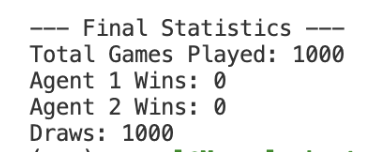
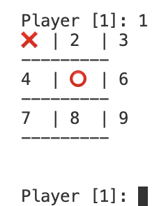

# Tik-Tac-Toe: Reinforcement Learning

This project implements Deep Q-Learning (DQN) and Q-Learning for training an agent in a given environment.

## Installation and Usage

1. Clone the repository:
```bash
git clone https://github.com/manvel-khnkoyan/tic-tac-toe.git
cd tic-tac-toe
```

2. Install the required packages:

```bash
python3 -m venv env
```

3. Activate the virtual environment:
```bash
source env/bin/activate
```

4. Install the required packages:
```bash
pip install -r requirements.txt
```

## Training Agents

#### Train using Q-Learning

Each training will create a new model file in the `src/__models__` directory.

```bash
python3 src/qlearn/qlearn_train.py
```

#### Train using Deep Q-Learning (DQN)

```bash
python3 src/dqn/dqn_train.py
```

## Play The Game

After training, you can play using the trained models either against each other or against a human player.

```bash
python3 src/play.py --player1=human --player2=qlearn
```

options for player1 and player2 are: `human`, `dqn`, `qlearn`


#### Examples

Play against a human player:

```bash
python3 src/play.py --player1=human --player2=dqn
```



Against two trained agents:

```bash
python3 src/play.py --player1=dqn --player2=qlearn
```



